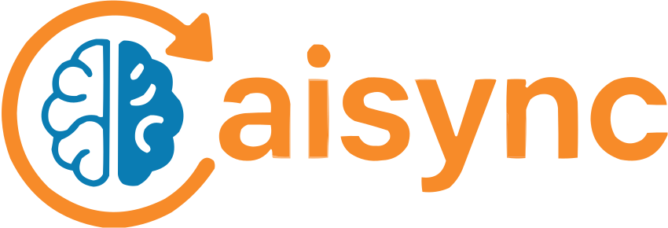

# 

[](https://www.npmjs.com/package/gptsync)
[](LICENSE)

Seamlessly sync the latest AI output in a flash. 🧠⚡

`gptsync` is a simple yet powerful tool that automatically finds the most recent `.zip` file in your Downloads folder, typically output from AI systems, and extracts it to your current working directory. Perfect for quickly managing and updating AI-generated files.

## Features

- **Automatic file detection**: Finds the most recent `.zip` file from your Downloads folder.
- **Instant extraction**: Extracts files directly into your current working directory.
- **Command-line interface**: Easy-to-use CLI with the command `gptsync`.
- **AI-centric**: Perfect for handling output from AI tools and systems.

## Installation

```bash
npm install gptsync
```

## Usage

You can use `gptsync` from the command-line anywhere with `npx`:

```bash
npx gptsync
```

It will:
1. Find the most recent `.zip` file in your Downloads folder.
2. Extract it into your current working directory.

### Important Note:
- **Git Repository Must Be Clean**: 
  The tool checks if the Git repository is clean (no uncommitted changes or untracked files). If the repository is not clean, the extraction will not occur unless you pass the `--force` (`-f`) flag:

   ```bash
   npx gptsync --force
   ```

   This will allow the extraction even if the Git history is not clean. Use this flag cautiously.

## License

This project is licensed under the [MIT License](LICENSE).
